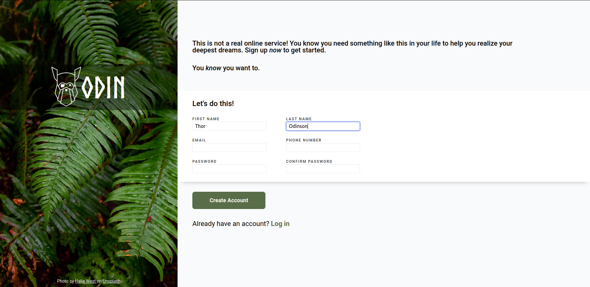

# Sign-up Form

This is a project from [The Odin Project](https://www.theodinproject.com/lessons/intermediate-html-and-css-sign-up-form)
intended to practice some intermediate html and css concepts such as form validation. Please note
that hhe layout is not intended to be responsive and works well only on desktop sizes for now.

## Preview

Here is a preview of the webpage as of now.

